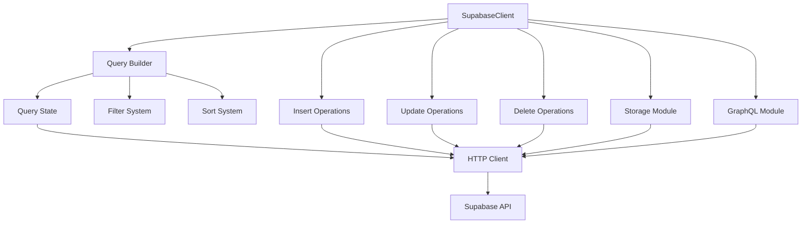
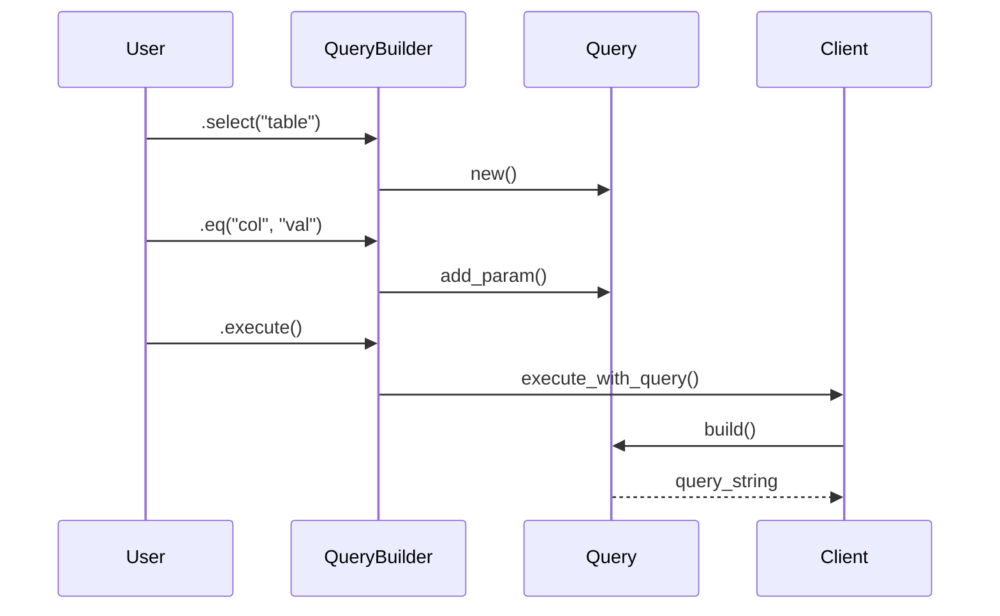
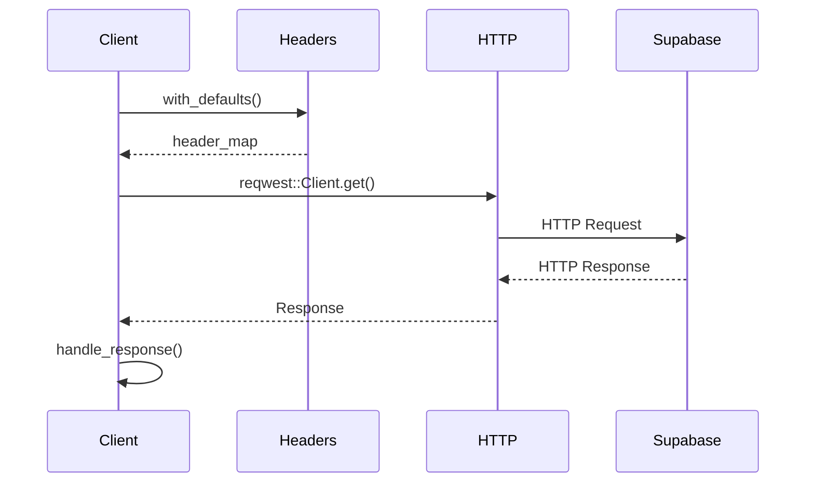

# Architecture Documentation

This document provides a comprehensive overview of the `supabase_rs` SDK architecture, design decisions, and extension points for contributors and advanced users.

## 🏗️ High-Level Architecture



## 🎯 Core Design Principles

### 1. Fluent Interface Design

The SDK uses a fluent interface pattern for intuitive query construction:

```rust
client
    .select("users")           // Start query
    .eq("status", "active")    // Add filter
    .order("created_at", false) // Add sorting
    .limit(50)                 // Add limit
    .execute()                 // Execute
    .await?;
```

**Benefits:**
- Natural, readable query construction
- Method chaining reduces boilerplate
- IDE autocomplete guides usage
- Compile-time validation

### 2. Connection Pool Management

```rust
#[derive(Debug, Clone)]
pub struct SupabaseClient {
    url: String,
    api_key: String,
    client: reqwest::Client,  // Shared connection pool
}
```

**Key Features:**
- `Clone` is cheap - shares underlying `reqwest::Client`
- Connection pooling handled automatically
- Thread-safe for concurrent usage
- Efficient resource utilization

### 3. Error Handling Strategy

The SDK uses a layered error handling approach:

```rust
// High-level: Simple string errors for end users
pub async fn insert(&self, table: &str, data: T) -> Result<String, String>

// Low-level: Structured errors for library internals  
pub type Result<T> = std::result::Result<T, ErrorTypes>;
```

**Design Rationale:**
- String errors are user-friendly and actionable
- Structured errors provide detailed context for debugging
- Consistent error patterns across all operations

## 🔧 Module Architecture

### Core Modules

#### 1. Query Builder System

```text
query_builder/
├── mod.rs          # Public API exports
├── builder.rs      # QueryBuilder implementation
├── filter.rs       # Filter operations and Display trait
└── sort.rs         # Sort operations and Display trait
```

**Responsibilities:**
- Fluent API for query construction
- Parameter validation and encoding
- Query string generation
- Type-safe filter operations

#### 2. CRUD Operations

```text
├── select.rs       # Query execution and response handling
├── insert.rs       # Insert operations (single and bulk)
├── update.rs       # Update and upsert operations
└── delete.rs       # Delete operations
```

**Design Pattern:**
Each module implements methods on `SupabaseClient` using `impl` blocks:

```rust
impl SupabaseClient {
    pub async fn insert<T>(&self, table: &str, data: T) -> Result<String, String>
    where T: serde::Serialize
    {
        // Implementation
    }
}
```

#### 3. Feature-Gated Modules

```text
├── storage/        # File operations (feature = "storage")
├── graphql/        # GraphQL support (feature = "nightly")
└── realtime/       # Real-time subscriptions (planned)
```

**Feature Flag Strategy:**
- Optional functionality behind feature flags
- Reduces binary size for unused features
- Allows experimental features without stability guarantees

## 🔄 Request/Response Flow

### 1. Query Construction



### 2. HTTP Request Processing



## 🎨 Design Patterns

### 1. Builder Pattern

Used extensively for query construction:

```rust
pub struct QueryBuilder {
    client: SupabaseClient,
    query: Query,
    table_name: String,
}

impl QueryBuilder {
    pub fn eq(mut self, column: &str, value: &str) -> Self {
        self.query.add_param(column, &format!("eq.{}", value));
        self
    }
}
```

### 2. Type State Pattern

Ensures compile-time query validity:

```rust
// Future enhancement: Type-safe query states
pub struct QueryBuilder<State> {
    // State ensures certain methods are only available at appropriate times
}
```

### 3. Error Conversion Pattern

Consistent error handling across modules:

```rust
impl From<reqwest::Error> for ErrorTypes {
    fn from(err: reqwest::Error) -> Self {
        ErrorTypes::ReqwestError(err)
    }
}
```

## 🚀 Performance Optimizations

### 1. Connection Pooling

```rust
// Shared connection pool across all client clones
#[derive(Clone)]
pub struct SupabaseClient {
    client: reqwest::Client, // Connection pool managed here
}
```

### 2. Query String Caching

```rust
impl Query {
    pub fn build(&self) -> String {
        // Efficient string building with pre-allocated capacity
        let mut query_string = String::with_capacity(estimated_size);
        // ... build query
    }
}
```

### 3. Lazy Evaluation

Queries are built but not executed until `.execute()` is called:

```rust
let query = client
    .select("users")
    .eq("status", "active"); // No HTTP request yet

let results = query.execute().await?; // HTTP request happens here
```

## 🔌 Extension Points

### 1. Adding New Filter Operations

```rust
// In query_builder/builder.rs
impl QueryBuilder {
    pub fn your_new_filter(mut self, column: &str, value: &str) -> Self {
        self.query.add_param(column, &format!("your_op.{}", value));
        self
    }
}
```

### 2. Adding New CRUD Operations

```rust
// In a new module or existing CRUD module
impl SupabaseClient {
    pub async fn your_operation(&self, params: T) -> Result<R, String> {
        let endpoint = self.endpoint(table_name);
        // Implementation
    }
}
```

### 3. Adding Feature-Gated Modules

```rust
// In Cargo.toml
[features]
your_feature = []

// In lib.rs
#[cfg(feature = "your_feature")]
pub mod your_module;

// In your_module/mod.rs
#![cfg(feature = "your_feature")]
```

## 🔍 Error Handling Architecture

### Error Type Hierarchy

```rust
// High-level structured errors
#[derive(thiserror::Error, Debug)]
pub enum ErrorTypes {
    #[error("Network error: {0}")]
    ReqwestError(#[from] reqwest::Error),
    // ... other variants
}

// User-facing string errors
type UserResult<T> = Result<T, String>;
```

### Error Conversion Strategy

```rust
// Internal errors are converted to user-friendly strings
impl From<ErrorTypes> for String {
    fn from(err: ErrorTypes) -> String {
        match err {
            ErrorTypes::ApiKeyMissing => {
                "API key missing - set SUPABASE_KEY environment variable".to_string()
            },
            // ... other conversions
        }
    }
}
```

## 🔧 Configuration Management

### Environment Variables

```rust
// Centralized configuration handling
fn get_config() -> Result<Config, ErrorTypes> {
    Ok(Config {
        url: std::env::var("SUPABASE_URL")?,
        key: std::env::var("SUPABASE_KEY")?,
        // ... other config
    })
}
```

### Feature Flag Management

```rust
// Conditional compilation for features
#[cfg(feature = "storage")]
pub mod storage;

#[cfg(feature = "nightly")]
pub mod graphql;
```

## 🧪 Testing Architecture

### Test Organization

```text
tests/
├── integration/
│   ├── crud_operations.rs
│   ├── query_builder.rs
│   └── storage_operations.rs
├── unit/
│   ├── query_building.rs
│   ├── error_handling.rs
│   └── utils.rs
└── performance/
    ├── bulk_operations.rs
    └── query_performance.rs
```

### Test Utilities

```rust
// Shared test utilities
pub fn create_test_client() -> SupabaseClient {
    SupabaseClient::new(
        std::env::var("SUPABASE_URL").expect("Test env required"),
        std::env::var("SUPABASE_KEY").expect("Test env required"),
    ).expect("Failed to create test client")
}

pub async fn cleanup_test_data(client: &SupabaseClient, table: &str, ids: &[String]) {
    for id in ids {
        let _ = client.delete(table, id).await;
    }
}
```

## 🚀 Future Architecture Considerations

### 1. Type-Safe Query Building

```rust
// Planned: Compile-time query validation
pub struct TypedQueryBuilder<T> 
where T: serde::Deserialize
{
    // Type-safe column references
    // Compile-time query validation
}
```

### 2. Async Streaming

```rust
// Planned: Streaming for large datasets
pub async fn select_stream(&self, table: &str) -> impl Stream<Item = Result<Value, String>> {
    // Stream results for memory efficiency
}
```

### 3. Connection Management

```rust
// Planned: Advanced connection configuration
pub struct ClientConfig {
    pub timeout: Duration,
    pub retry_policy: RetryPolicy,
    pub connection_pool_size: usize,
}
```

## 📊 Performance Characteristics

### Benchmarks

| Operation | Avg Time | Memory Usage | Notes |
|-----------|----------|--------------|-------|
| Client Creation | ~1ms | 2KB | One-time cost |
| Simple Query | ~50ms | 1KB | Network dependent |
| Bulk Insert (100 rows) | ~200ms | 10KB | Efficient batching |
| Complex Query | ~100ms | 5KB | Multiple filters |

### Optimization Strategies

1. **Query Optimization**
   - Parameter pre-allocation
   - String building efficiency
   - Minimal allocations

2. **HTTP Optimization**
   - Connection reuse
   - Request batching
   - Response streaming

3. **Memory Optimization**
   - Clone efficiency
   - Minimal data copying
   - Efficient serialization

## 🔗 Dependencies

### Core Dependencies

- **`reqwest`**: HTTP client with connection pooling
- **`serde_json`**: JSON serialization/deserialization
- **`tokio`**: Async runtime
- **`thiserror`**: Error handling

### Optional Dependencies

- **`anyhow`**: Error handling utilities
- **`uuid`**: ID generation
- **`chrono`**: Date/time handling

### Dependency Rationale

Each dependency is chosen for:
- **Performance**: Efficient implementations
- **Reliability**: Well-maintained and tested
- **Compatibility**: Works well with other crates
- **Size**: Minimal impact on binary size

## 🔮 Roadmap

### Short Term (v0.5.x)

- [ ] Stabilize GraphQL mutations
- [ ] Add file upload to Storage
- [ ] Improve error messages
- [ ] Performance optimizations

### Medium Term (v0.6.x)

- [ ] Type-safe query building
- [ ] Streaming support
- [ ] Advanced authentication
- [ ] Real-time subscriptions

### Long Term (v1.0+)

- [ ] Full GraphQL support
- [ ] Advanced caching
- [ ] Connection management
- [ ] Performance monitoring

This architecture provides a solid foundation for current functionality while allowing for future enhancements and optimizations.
